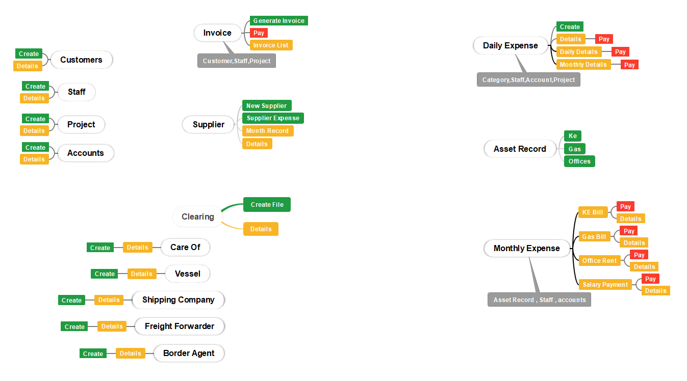

# 📦 Custom Clearing Management System

A Laravel-based web application developed to streamline and automate the customs clearance process for companies handling shipment clearance from ports and airports.

This system centralizes document management, shipment tracking, expense logging, and client operations — replacing outdated manual workflows with modern, secure digital processes.

---

## 🌟 Key Features

- 📁 **Customs Documentation Management**  
  Upload, store, and track required documents (invoices, shipping papers, packing lists).

- 🚢 **Shipment Tracking**  
  Monitor clearance stages: document submission, customs review, release, etc.

- 👥 **Client & Agent Management**  
  Manage records of clients, agents, and brokers in one place.

- 💸 **Expense Logging & Invoicing**  
  Log duty, port charges, agent fees — auto-generate PDF invoices.

- 📊 **Reports & Dashboards**  
  View shipment status summaries, financial reports, and activity logs.

- 🔐 **Role-Based Access Control**  
  Permissions for Admin, Agent, and Client roles.

---

## ⚙️ Technology Stack

| Layer         | Tools & Frameworks                                      |
|---------------|----------------------------------------------------------|
| Backend       | Laravel 10.x (PHP 8.1+)                                   |
| Frontend      | Blade Templating, Bootstrap, Tailwind CSS                 |
| Database      | MySQL / MariaDB                                           |
| Auth System   | Laravel Sanctum                                           |
| API & HTTP    | Guzzle HTTP Client                                        |
| Dev Tools     | Laravel Sail, Laravel Pint, PHPUnit, Mockery, Faker PHP  |
| Extras        | File Uploads, Laravel Notifications, PDF Generation, Custom Helpers |

---

## 📌 Use Case Scenarios

- A **customs clearing company** managing client shipments through ports and airports.
- A **clearance agent** tracking documentation, workflow status, and shipment progress.
- A **finance/admin team** logging customs-related expenses and issuing invoices.
- A company seeking to **automate routine tasks** and reduce operational delays.

---

## 🧠 Mind Map

---

## 🎥 Demo Video

[▶️ Watch Demo](https://your-demo-video-link.com)

---

## 🔐 Confidentiality Note

This project was delivered for a private client and contains proprietary business workflows.  
While the full source code is not public, this repository includes planning materials and a feature showcase via video and mind map.

---

## 📎 Contact

For collaboration or to request a demo, please contact:  
**Seemab** — seemabshafqat00223@gmail.com

---

